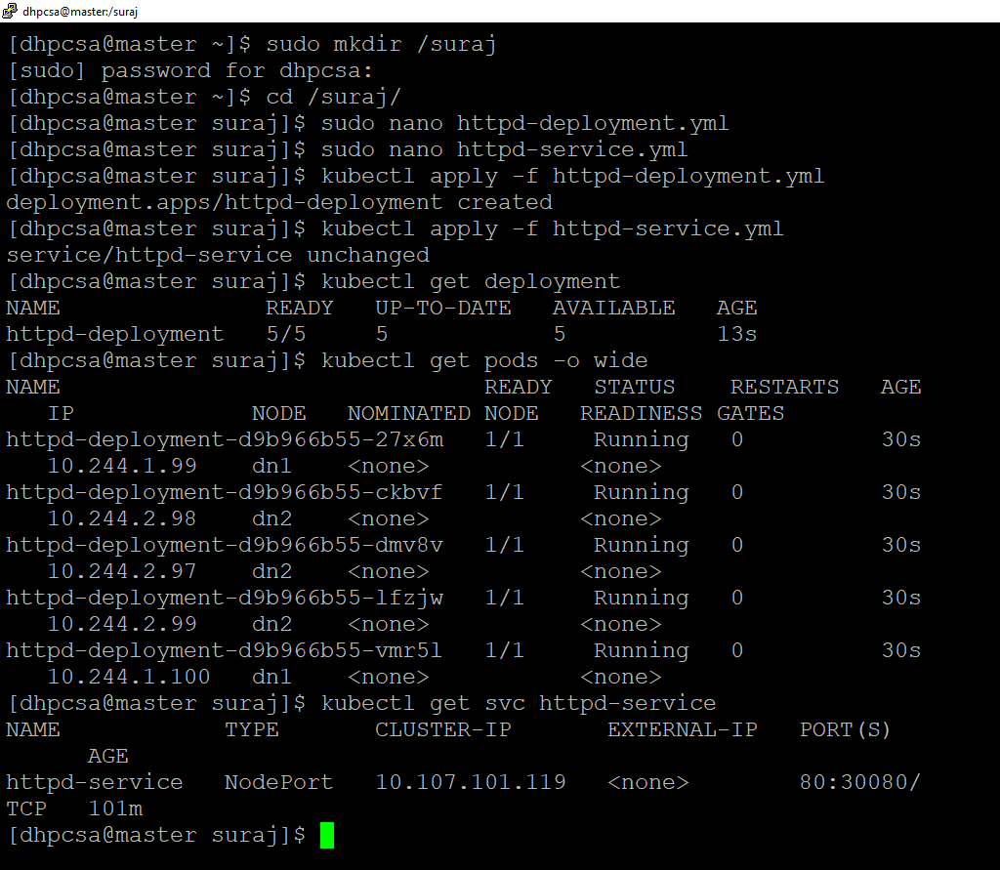

## HTTPD Deployment with Custom Page and NodePort Service Using Single *yml* file

*This guide outlines the steps to create a Kubernetes deployment with 5 replicas of the HTTPD server, expose it externally with a NodePort service, and replace the default Apache page with a custom HTML page.*

### Follow Below Steps to Implement.
<br>
### Step 1: Create a Custom HTML Page

- First, create a custom index.html file with the content you'd like to display.

   - Sample HTML file (index.html):
 
```yml
  <!DOCTYPE html>
<html lang="en">
<head>
    <meta charset="UTF-8">
    <meta name="viewport" content="width=device-width, initial-scale=1.0">
    <title>Custom Apache Page</title>
</head>
<body>
    <h1>Welcome to My Custom Apache Web Server!</h1>
    <p>This page is served by an Apache container running in Kubernetes.</p>
</body>
</html>

```


### Step 2: Create Kubernetes Resources
- Create a YAML file, httpd-deployment.yml, which includes:

1. A ConfigMap for the custom HTML page.
2. A Deployment with 5 replicas of the HTTPd server.
3. A NodePort service to expose the deployment externally.
   *httpd-deployment.yml  file Content:*


```yml

# ConfigMap for custom httpd page
apiVersion: v1
kind: ConfigMap
metadata:
  name: httpd-index-page
data:
  index.html: |
    <!DOCTYPE html>
    <html lang="en">
    <head>
      <meta charset="UTF-8">
      <meta name="viewport" content="width=device-width, initial-scale=1.0">
      <title>Custom Apache Page</title>
    </head>
    <body>
      <h1>Welcome to My Suraj file!</h1>
      <p>This page was served by an Apache container running in Kubernetes.</p>
    </body>
    </html>

---

# Deployment for httpd with 5 replicas
apiVersion: apps/v1
kind: Deployment
metadata:
  name: httpd-deployment
spec:
  replicas: 5
  selector:
    matchLabels:
      app: httpd
  template:
    metadata:
      labels:
        app: httpd
    spec:
      containers:
      - name: httpd
        image: httpd:latest
        ports:
        - containerPort: 80
        volumeMounts:
        - name: custom-index
          mountPath: /usr/local/apache2/htdocs/index.html
          subPath: index.html
      volumes:
      - name: custom-index
        configMap:
          name: httpd-index-page

---

# NodePort Service to expose httpd externally
apiVersion: v1
kind: Service
metadata:
  name: httpd-service
spec:
  selector:
    app: httpd
  ports:
  - protocol: TCP
    port: 80
    targetPort: 80
    nodePort: 30080  # Change as necessary
  type: NodePort
```


### Step 3: Apply the YAML File
- Run the following command to apply the configuration:


```yml
kubectl apply -f httpd-deployment.yml
```

### Step 4: Verify Deployment and Service
- Check the status of the deployment and services:

```yml

kubectl get deployments
kubectl get pods
kubectl get svc httpd-service

```

### Step 5: Access the Custom Web Page
- You can now access the custom page via the NodePort on any of your cluster node’s IPs.

  - Example URL format: http://<node-ip>:30080
        -Replace <node-ip> with the IP of any node in your cluster.

### Step 6: Scale the Deployment (Optional)
- To adjust the number of running HTTPd pods, use the following command:


```yml

# Scale up to 10 replicas
kubectl scale deployment httpd-deployment --replicas=10

```


- Check the updated status:

```yml
kubectl get deployment httpd-deployment
kubectl get pods
```


### Step 7: Clean Up (Optional)
- To delete the deployment, service, and ConfigMap, use:

```yml

kubectl delete -f httpd-deployment.yml
```


<br>
<br>

## Summary
- Created 5 replicas of HTTPd with a custom index page.
- Exposed the HTTPd deployment via a NodePort service for external access.
- Scaled the deployment as needed for additional capacity.

  <br>
  
## *This setup demonstrates how to deploy, expose, and customize an Apache HTTPd service in Kubernetes.*


<br>
<br>
<br>


## ------------------Screnshots--------------------
1.
<br>
<br>




2.
<br>
<br>


3.
<br>
<br>


<br>
<br>


